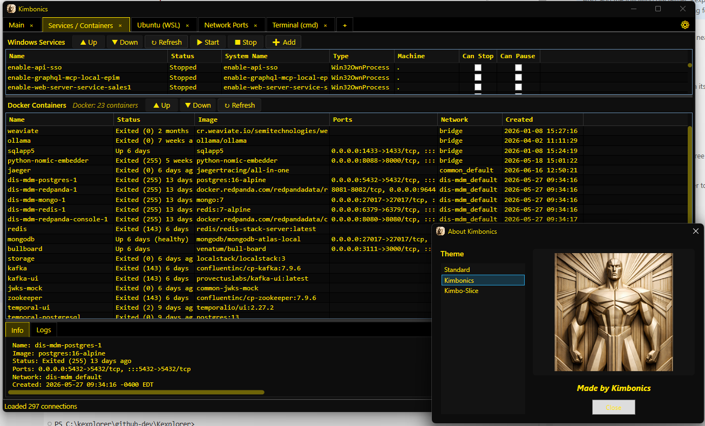

# Kexplorer — Multi-Tabbed Windows Explorer

## New in 2026: Kexplorer.Modern

Kexplorer.Modern was introduced in the first half of 2026 as the new version of Kexplorer.

- Tighter integration with WSL and Docker
- Windows Services tab is split with dedicated Docker Containers status
- Completed terminal session tabs: PowerShell, Cmd, and Linux Bash

Start here: **[Kexplorer.Modern/README.md](./Kexplorer.Modern/README.md)**

---

A high-performance, multi-tabbed file explorer for Windows developers. **New to this project? Start with [Kexplorer Modern](#-kexplorer-modern-recommended)** — the cutting-edge .NET 8 WPF version built for developers who use Windows, WSL, Docker, and remote systems.

Disclaimer: Kexplorer is opinionated to how I work. Feel free to fork your own copy and add your own handling for certain file types.



---

## 🚀 Kexplorer Modern (Recommended)

**[Kexplorer.Modern/](./Kexplorer.Modern/)** — A complete modern rewrite targeting .NET 8 and WPF.

### Why Kexplorer Modern?

- **Advanced hybrid environment support** — Windows + WSL + Docker in one unified interface
- **Modern async architecture** — Built on `async/await` with true background work queues—no UI freezes
- **Sophisticated plugin system** — Easily extensible with attribute-based capability declarations
- **Better performance** — Lazy-loading trees, per-tab work queues, proper CancellationToken support
- **Actively developed** — Ongoing phases for AI integration, MCP server, and plugin marketplace

### Quick Start (Kexplorer Modern)

```powershell
cd Kexplorer.Modern
dotnet build
dotnet run --project Kexplorer.UI
```

**See [Kexplorer.Modern/README.md](./Kexplorer.Modern/README.md) for the modern overview and requirements.**
**See [Kexplorer.Modern/Kexplorer.UI/README.md](./Kexplorer.Modern/Kexplorer.UI/README.md) for full UI documentation.**

---

## 📖 Historical Context — Kexplorer Legacy

**Kexplorer** is a Multi-Tabbed Windows Explorer alternative I started back in **2004**. The legacy version (in the `/Kexplorer` directory) is a Windows Forms application that introduced:

### Original Design Goals (Still Valid)

As a programmer working with hundreds of files across drives and network shares, I needed to solve Windows Explorer's key productivity drawbacks:

1. **Multi-Tabbed Interface** — TreeView of folders on left, detailed file grid on right. Work with multiple locations without opening separate windows.

2. **Multi-Threaded Responsiveness** — File system loading runs on background worker threads. No more 30-60 second freeze-ups when right-clicking files.

3. **Custom Context Menus** — Fast, focused context menus without bloated icons.

4. **Services Tab** — Stop/start/restart Windows services in a tab instead of Control Panel.

5. **Extensible Scripting Framework** — Integrate custom tools:
   - Zip/Unzip files with workflow support
   - Quick path copy (full name or filename only)
   - XML/XSLT transforms
   - XML validation
   - Windows grep integration
   - Rename, delete, make directory operations

6. **Passive File Monitoring** — No automatic refresh (prevents Explorer freezes). Explicit F5 refresh only.

7. **No Drag-and-Drop** — By design. Too many accidental file moves in high-volume environments.

### Legacy Project Structure

```
Kexplorer/                      — Legacy Windows Forms application
├── Kexplorer.csproj          — Main project file
├── src/                        — Core controllers, nodes, work units (20 files)
├── res/                        — Windows Forms UI dialogs (11 files)
├── services/src/               — Windows service management (9 files)
├── scripting/src/              — Script system infrastructure (12 files)
└── scripts/src/                — Built-in scripts (45+ files)
```

### Legacy Features

- **KExplorerControl** — Main controller orchestrating UI and work pipelines
- **Pipeline System** — Background work queue with priority handling
- **KExplorerNode** — Tree node model for file system
- **Script Manager** — Reflection-based plugin discovery and execution
- **FTP Support** — Browse FTP sites in tabs alongside Windows folders
- **Session Persistence** — Saves tabs and window state across sessions

---

## 🔄 Migrating from Legacy to Modern

All core functionality from the legacy version is being ported to Kexplorer Modern:

| Feature | Legacy | Modern | Status |
|---------|--------|--------|--------|
| Multi-tabbed explorer | ✅ | ✅ | Complete |
| Tree + Grid split panel | ✅ | ✅ | Complete |
| Services management | ✅ | ✅ | Complete |
| File/folder plugins | ✅ | ✅ | Complete (10 core plugins) |
| Launcher service | ✅ | ✅ | Modernized to JSON |
| Session persistence | ✅ | ✅ | Complete |
| **WSL support** | ❌ | ✅ | **New in Modern** |
| **Docker integration** | ❌ | ✅ | **New in Modern** |
| **Async architecture** | ❌ | ✅ | **New in Modern** |
| **Modern UI (WPF)** | ❌ | ✅ | **New in Modern** |

**Migration tracking:** See [Kexplorer.Modern/MIGRATION_NOTES.md](./Kexplorer.Modern/MIGRATION_NOTES.md)

---

## 📂 Repository Structure

```
Kexplorer/
├── README.md                    — This file
├── Kexplorer/                   — Legacy Windows Forms application
│   ├── Kexplorer.csproj
│   ├── src/                     — Core logic
│   ├── res/                     — UI forms and dialogs
│   └── scripts/                 — Custom script implementations
│
├── Kexplorer.Modern/            — Modern .NET 8 WPF rewrite (RECOMMENDED)
│   ├── Kexplorer.Modern.sln
│   ├── Kexplorer.Core/          — Domain models, work queue, plugins
│   ├── Kexplorer.UI/            — WPF application (start here!)
│   ├── Kexplorer.Plugins/       — Built-in plugins
│   ├── Kexplorer.Core.Tests/    — Test suite
│   ├── Kexplorer.MCP/           — MCP server (Phase 3)
│   ├── Kexplorer.AI/            — AI features (Phase 3)
│   ├── Kexplorer.UI/README.md   — Comprehensive UI documentation
│   └── MIGRATION_NOTES.md       — Detailed phase status
│
└── specifications/              — Design specifications
    ├── 01-Modern-Refresh.md     — Full Kexplorer Modern spec
    └── 03-bugs-and-enhancements/
```
		
	

